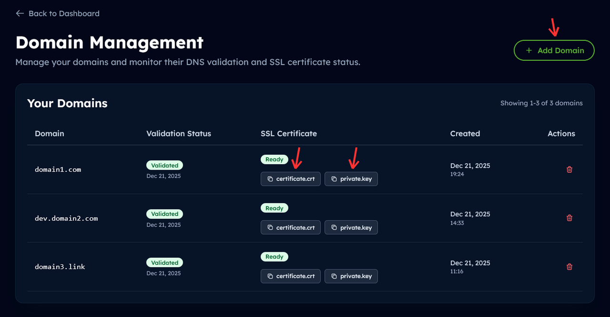

# DevNS.me Example Setup with Traefik

This repository demonstrates how to set up a modern local development environment using Docker, Traefik, and [DevNS.me](https://devns.me) for multi-project hosting with custom domains and HTTPS support.

## What is DevNS.me?

**DevNS.me** is a next-generation DNS utility service for developers, inspired by xip.io, nip.io, and traefik.me. It provides dynamic DNS resolution with powerful features like:

- **Wildcard DNS**: Embed IP addresses in subdomains (e.g., `192-168-1-10.devns.me` → `192.168.1.10`)
- **Custom Domain Support**: Delegate your own domain (e.g., `example.com`) to DevNS.me nameservers
- **HTTPS Certificates**: Automatic Let's Encrypt certificate issuance for custom domains via DNS-01 challenge
- **LAN Access**: Test your projects from any device on your local network

## Why This Setup?

This repository provides a **recommended Docker + Traefik layout** for local development that:

- **Runs multiple projects simultaneously** without port conflicts (no more `:3000`, `:8080`, `:5000`)
- **Routes traffic by domain name** - each project gets its own domain instead of different ports
- **Test from any device on your network** - Access your projects from phones, tablets, or other computers using DevNS.me domains (e.g., `myapp-192-168-1-10.devns.me`)
- **HTTPS support for local development** - Test OAuth, payments, PWAs, and modern browser APIs that require secure connections
- **Scales easily** as you add more projects - just create a new docker-compose and add it to the network

## Architecture Overview

```
┌─────────────────────────────────────────────────────────┐
│                     Traefik Proxy                       │
│  HTTP :80  │  HTTPS :443  │  Dashboard :8080            │
└──────┬──────────────────┬───────────────────────────────┘
       │                  │
       ├──────────────────┼───► project1.localhost
       │                  │     project1-192-168-1-10.devns.me
       │                  │
       └──────────────────┼───► project2.localhost
                          └───► project2-192-168-1-10.example.com (HTTPS)
```

## Prerequisites

- Docker and Docker Compose installed
- Basic understanding of Docker and DNS
- For HTTPS: A custom domain registered and configured via [account.devns.me](https://account.devns.me)

## Repository Structure

```
devns-example/
├── traefik/              # Traefik reverse proxy configuration
│   ├── docker-compose.yml
│   ├── .env.template     # Traefik environment variables (copy to .env)
│   └── .docker/
│       └── traefik/
│           ├── setup-certs.sh      # Auto-download and configure certificates
│           └── tls.yml.template    # TLS configuration template
├── project1/             # Example: HTTP only with .localhost and .devns.me
│   ├── docker-compose.yml
│   └── .env.template     # Project environment variables (copy to .env)
└── project2/             # Example: HTTP + HTTPS with custom domain
    ├── docker-compose.yml
    └── .env.template     # Project environment variables (copy to .env)
```

> **Note**: Each directory contains a `.env.template` file that must be copied to `.env` and configured with your values. The `.env` files are in `.gitignore` as they contain local-specific configuration.

## Quick Start

### 1. Set Up Traefik

First, start the Traefik reverse proxy:

```bash
cd traefik
cp .env.template .env
# Edit .env to configure HTTPS certificates (optional - see Mode 3 below)
# For basic HTTP-only setup, the default values work as-is
docker compose up -d
```

Traefik dashboard will be available at http://localhost:8080

> **Note**: If you haven't configured HTTPS certificates in `.env`, the system will work perfectly for HTTP and `.localhost` domains. HTTPS is only needed for Mode 3 (custom domains).

### 2. Start Example Projects

```bash
# Project 1 - HTTP only
cd project1
cp .env.template .env
# Edit .env: Replace 192-168-1-10 with your actual local IP (dashed format)
docker compose up -d

# Project 2 - HTTP + HTTPS
cd project2
cp .env.template .env
# Edit .env: Replace 192-168-1-10 with your local IP and example.com with your custom domain
docker compose up -d
```

## Three Access Modes

This setup supports three different ways to access your projects:

### Mode 1: `.localhost` Domain (Local Only)

**Use case**: Quick local development on your machine only.

**Configuration**:

In your project's `.env`:
```env
APP_DOMAIN=myproject.localhost
```
Replace `myproject` with your project name.

In your project's `docker-compose.yml`:
```yaml
labels:
  - traefik.enable=true
  - traefik.http.routers.${COMPOSE_PROJECT_NAME}.rule=Host(`${APP_DOMAIN}`)
  - traefik.http.services.${COMPOSE_PROJECT_NAME}.loadbalancer.server.port=80
```

> **Note**: The `loadbalancer.server.port=80` refers to the port your application listens on **inside the container**. Change this if your app uses a different port (e.g., 3000 for Node.js/React, 5000 for Flask/Python).

**Access**:
- URL: http://myproject.localhost
- Available: Only from your computer
- HTTPS: Not available (browser limitation)

**Example**: See [project1/.env.template](project1/.env.template) and [project1/docker-compose.yml](project1/docker-compose.yml)

---

### Mode 2: `.devns.me` Domain (HTTP, LAN-Accessible)

**Use case**: Access your project from other devices on your local network (phones, tablets, other computers) via HTTP.

**Configuration**:

In your project's `.env`:
```env
APP_DOMAIN_LAN=myproject-192-168-1-10.devns.me
```
Replace `myproject` with your project name and `192-168-1-10` with your local IP in **dashed format** (dots → dashes).

In your project's `docker-compose.yml`:
```yaml
labels:
  - traefik.enable=true
  - traefik.http.routers.${COMPOSE_PROJECT_NAME}.rule=Host(`${APP_DOMAIN}`) || Host(`${APP_DOMAIN_LAN}`)
  - traefik.http.services.${COMPOSE_PROJECT_NAME}.loadbalancer.server.port=80
```

**Access**:
- URL: http://myproject-192-168-1-10.devns.me
- Available: From any device on your local network
- HTTPS: Not available (no certificate)

**Example**: See [project1/.env.template](project1/.env.template) and [project1/docker-compose.yml](project1/docker-compose.yml)

**How to find your local IP**:
```bash
# Linux/Mac
ip addr show | grep "inet " | grep -v 127.0.0.1
# or
hostname -I

# Windows (Command Prompt or PowerShell)
ipconfig

# Look for "IPv4 Address" under your active network adapter
# Convert: 192.168.1.10 → 192-168-1-10
```

---

### Mode 3: Custom Domain (HTTP + HTTPS, LAN-Accessible)

**Use case**: Full HTTPS support for testing OAuth, PWAs, payment integrations, and other services that require secure connections.

**Requirements**:
1. **Own a domain** - Can be a second-level domain (e.g., `example.com`) or any subdomain (e.g., `dev.example.com`)

2. **Delegate to DevNS.me nameservers** - The process depends on the domain level:

   - **For a second-level domain** (e.g., `example.com`):
     Update the nameservers at your domain registrar to:
     - `ns1.devns.me`
     - `ns2.devns.me`

   - **For a subdomain** (e.g., `dev.example.com`):
     Add NS records in your domain's DNS zone:
     ```
     dev.example.com.  IN  NS  ns1.devns.me.
     dev.example.com.  IN  NS  ns2.devns.me.
     ```

3. **Register domain** at [account.devns.me](https://account.devns.me)

4. **Get certificate URLs** from DevNS.me dashboard (`certificate.crt` and `private.key` URLs)

   

**Configuration**:

In your project's `.env`:
```env
APP_DOMAIN_LAN=myproject-192-168-1-10.example.com
```
Replace `myproject` with your project name, `192-168-1-10` with your local IP in **dashed format**, and `example.com` with your custom domain.

In `traefik/.env`:
```env
HTTPS_CERT_URL_1=https://cert.devns.me/{YOUR_TOKEN}/certificate.crt
HTTPS_KEY_URL_1=https://cert.devns.me/{YOUR_TOKEN}/private.key
```
Replace with the **complete URLs** provided by the DevNS.me dashboard. The URLs include a security token to keep your private key secure.

In your project's `docker-compose.yml`, add HTTPS labels:
```yaml
labels:
  - traefik.enable=true
  - traefik.http.routers.${COMPOSE_PROJECT_NAME}.rule=Host(`${APP_DOMAIN}`) || Host(`${APP_DOMAIN_LAN}`)
  - traefik.http.routers.${COMPOSE_PROJECT_NAME}-https.rule=Host(`${APP_DOMAIN_LAN}`)
  - traefik.http.routers.${COMPOSE_PROJECT_NAME}-https.tls=true
  - traefik.http.services.${COMPOSE_PROJECT_NAME}.loadbalancer.server.port=80
```

**Access**:
- HTTP: http://myproject-192-168-1-10.example.com
- HTTPS: https://myproject-192-168-1-10.example.com
- Available: From any device on your local network

**Example**: See [project2/.env.template](project2/.env.template) and [project2/docker-compose.yml](project2/docker-compose.yml)

> **Important**: Only **dashed-format** addresses work with HTTPS wildcard certificates. `myproject.192.168.1.10.example.com` (dots) will NOT work, use `myproject-192-168-1-10.example.com` (dashes) instead.

#### Adding Multiple Custom Domains / Certificates

The Traefik setup supports multiple custom domains with different SSL certificates. The system automatically detects and configures all certificate pairs you add to the `.env` file.

**Add certificate pairs to `traefik/.env`**:

```env
# Domain 1 (e.g., example.com)
HTTPS_CERT_URL_1=https://cert.devns.me/{TOKEN1}/certificate.crt
HTTPS_KEY_URL_1=https://cert.devns.me/{TOKEN1}/private.key

# Domain 2 (e.g., mycompany.dev)
HTTPS_CERT_URL_2=https://cert.devns.me/{TOKEN2}/certificate.crt
HTTPS_KEY_URL_2=https://cert.devns.me/{TOKEN2}/private.key

# Domain 3 (e.g., staging.app)
HTTPS_CERT_URL_3=https://cert.devns.me/{TOKEN3}/certificate.crt
HTTPS_KEY_URL_3=https://cert.devns.me/{TOKEN3}/private.key

# Add as many as you need - just increment the number
HTTPS_CERT_URL_4=...
HTTPS_KEY_URL_4=...
```

4. **Restart Traefik** to apply changes:

```bash
cd traefik
docker compose down
docker compose up -d
```

That's it! The system will automatically:
- Download all certificates
- Generate the TLS configuration
- Configure Traefik to use them

## Common Use Cases for HTTPS in Development

Having HTTPS support in local development is essential for testing:

- **OAuth Integrations**: Facebook Login, Google Sign-In, GitHub OAuth
- **Payment Gateways**: Stripe, PayPal, Apple Pay
- **PWA Features**: Service Workers, Web Push Notifications
- **Modern Browser APIs**: Geolocation, Camera, Microphone, Clipboard
- **Secure Cookies**: Testing `Secure` and `SameSite` cookie attributes
- **Third-party Services**: Any API that requires HTTPS callbacks/webhooks

## Troubleshooting

### Project not accessible

- Verify Traefik is running: `docker ps | grep traefik`
- Check Traefik logs: `docker logs traefik-traefik-1`
- Verify network exists: `docker network ls | grep traefik_network`
- Check Traefik dashboard: http://localhost:8080

### HTTPS not working

- **Check certificate setup logs**: `docker logs traefik-traefik-https-helper-1`
  - The setup script shows detailed information about certificate download status
  - Look for "✓ Successfully downloaded" messages
- Verify certificates were downloaded: `docker exec traefik-traefik-1 ls -la /etc/ssl/traefik/`
- Check certificate URLs in `traefik/.env` are correct (no typos in tokens)
- Verify `tls.yml` was generated: `docker exec traefik-traefik-1 cat /etc/traefik/tls.yml`
- Ensure domain uses **dashed format** (e.g., `app-192-168-1-10.example.com`)
- Restart Traefik after certificate changes: `cd traefik && docker compose restart`

### Can't access from other devices

- Verify local IP is correct in `APP_DOMAIN_LAN`
- Check firewall allows ports 80 and 443
- Ensure devices are on the same network
- Try accessing by IP first: `http://192.168.1.10`

### DNS resolution issues

- Some ISPs may fail to resolve `*.devns.me` domains
- **Solution**: Use Google DNS servers (`8.8.8.8`, `8.8.4.4`) in your network settings
- Test with: `nslookup 192-168-1-10.devns.me 8.8.8.8`

## Learn More

- **DevNS.me Website**: https://devns.me
- **DevNS.me Account Portal**: https://account.devns.me (for custom domain registration)
- **Traefik Documentation**: https://doc.traefik.io/traefik/
